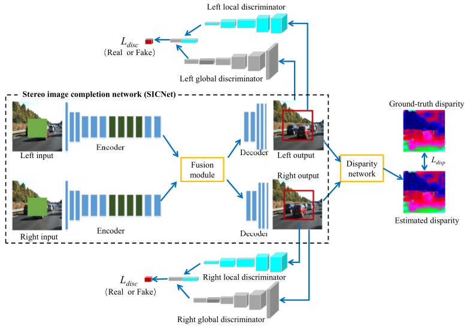

# SICNet

## Framework

&ensp;&ensp;The architecture of the proposed method for stereo image completion is shown in Fig.1. The main body, i.e. the part within the dashed box in the figure, is a fully convolutional network responsible for stereo image completion, called SICNet for short. Besides, we have several auxiliary branches used to train the network together with directly defined losses.

&ensp;&ensp;SICNet is designed to be an X-shaped encoder-fusion-decoder structure.It has two branches of encoders and decoders. The two branches have intersection in the middle to exchange cues. Given a pair of stereo images and their binary masks indicating regions to be repaired, SICNet treats each view as a four-channel (RGB and the binary mask) map and feeds the two views separately into the two branches of encoders. Each view is encoded to be lower-resolution featuremaps which could well express spatial context and lower subsequent computational complexity. The two views of feature maps are then sent to the fusion module for stereo-interactive repairing. Next, the generated feature maps are used to produce the completed two views, each being a three-channel RGB image, by two branches of decoders, separately.

## Dataset

&ensp;&ensp;Our experiments are performed on KITTI dataset, which contains 42382 rectified stereo pairs from 61 scenes. In order to avoid high correlation among image pairs, we resample the dataset with 1/5 of the original frequency. For convenience of training and fair quantitative comparison of different methods, we rescale the resampled 8476 images to 256 x 256, 8226 images for training, 250 images for testing. In practice, the trained model can be used for any size of images.

## Publication

@article{Ma2020Learning,  
&ensp;&ensp;author = {Ma, Wei and Zheng, Mana and Ma, Wenguang and Xu, Shibiao and Zhang, Xiaopeng},  
&ensp;&ensp;year = {2020},  
&ensp;&ensp;month = {05},  
&ensp;&ensp;pages = {},  
&ensp;&ensp;title = {Learning across Views for Stereo Image Completion},  
&ensp;&ensp;journal = {IET Computer Vision},  
&ensp;&ensp;doi = {10.1049/iet-cvi.2019.0775}  
}  

See more in [IET Digtial Library](https://digital-library.theiet.org/content/journals/10.1049/iet-cvi.2019.0775 "IET Computer Vision")
